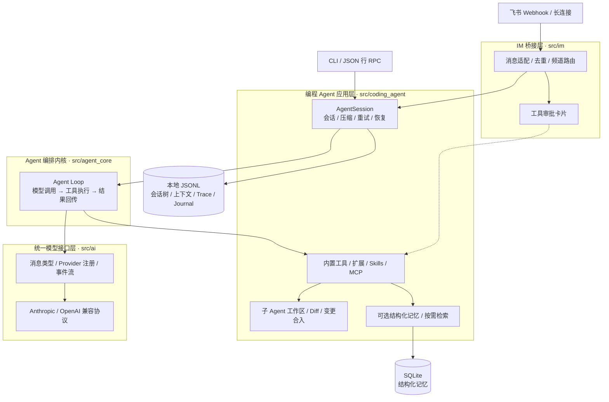
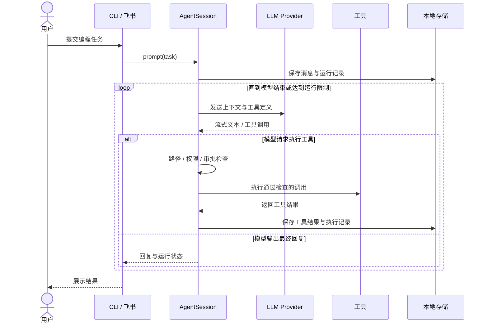
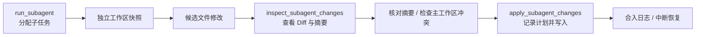

# LoopWeaver Coding Agent

> **LoopWeaver 是一个基于 Python 的 AI 编程助手。** 它把模型推理、工具调用和会话状态串联成完整的任务循环，支持通过命令行或飞书完成代码阅读、文件修改与命令执行。
>
> 项目重点关注 Agent 应用中的工程问题：**长任务如何保留上下文、工具执行如何受到约束、子 Agent 的修改如何合入，以及中断后如何判断能否继续执行。**


[项目简介](#overview) · [核心特性](#features) · [系统架构](#architecture) · [设计亮点](#design) · [快速开始](#quickstart) · [配置说明](#configuration) · [飞书集成](#feishu) · [测试与评测](#evaluation)

---

<a id="overview"></a>

## 📖 项目简介

LoopWeaver 围绕 **接收任务 → 模型推理 → 执行工具 → 回传结果 → 继续推理** 的 Agent Loop 构建，在此基础上提供会话持久化、上下文压缩、工具审批、执行追踪、子 Agent 工作区和长期记忆。

项目主要解决三个问题：

- **模型接入与执行逻辑耦合**：不同服务商使用不同的消息结构和流式协议，通过统一消息类型、Provider 注册和事件流，让 Agent 内核使用一致的调用方式。
- **长任务状态容易丢失**：将会话树、当前上下文、工具结果和操作日志写入本地存储，支持重新打开会话、分叉尝试和检查中断任务。
- **模型产生的操作需要可控、可检查**：为工具增加路径检查、只读策略、审批和结果脱敏；子 Agent 在独立工作区产生候选修改，合入前检查变更摘要和文件冲突。

**核心设计：统一模型接口 + 可持久化的执行循环 + 显式的工具与变更边界。** 模型决定下一步调用什么工具，运行时负责执行、记录状态，并根据已提交的证据判断任务能否继续。

---

<a id="features"></a>

## 🚀 核心特性

- 🔌 **统一模型接入**：提供 Anthropic 和 OpenAI 兼容协议实现，内置 Claude、OpenAI、DeepSeek 等模型配置，统一处理消息、工具调用与流式事件。
- 🧰 **编程工具集**：支持目录浏览、文件读写、精确编辑、内容检索、文件查找、Git 状态与 Diff、测试执行及 Bash 命令。
- 🌿 **会话树与持久化**：保存消息和节点关系，支持会话恢复、分叉与节点切换，让同一任务可以沿不同路径继续尝试。
- 🧠 **上下文管理**：支持按消息数量或估算 Token 阈值压缩历史，保留近期消息，并对暂时性模型错误进行退避重试。
- 🛡️ **工具约束与审批**：提供工作区路径检查、只读模式、危险命令拦截、结果脱敏，以及飞书交互卡片审批。
- 🤝 **子 Agent 与变更合入**：通过独立文件快照承接子任务，提供 Diff 预览、变更摘要校验、冲突检查和带日志的合入恢复流程。
- 🗃️ **可选结构化记忆**：使用 SQLite 保存事实、偏好与决策，通过 `memory_search` 按需检索，并限制缺乏新证据的重复查询。
- 🧩 **扩展与 MCP**：支持工作区扩展、按需加载 Skill 正文，以及 stdio MCP server 的工具发现与调用。
- 💬 **飞书桥接**：支持 Webhook 和长连接，提供频道会话路由、消息去重、待处理消息持久化与工具审批回调。
- 🔎 **执行追踪与评测**：记录模型调用、工具执行和运行状态，配套离线 Agent 场景、记忆对照评测与真实模型评测入口。

---

<a id="architecture"></a>

## 🏗️ 系统架构

项目分为四层，CLI 与飞书入口共享同一套编程 Agent 会话能力。



| 层次 | 职责 | 主要入口 |
|------|------|----------|
| **统一模型接口层** | 消息与模型类型、Provider 分发、流式响应 | [`src/ai`](src/ai) |
| **Agent 编排内核** | 推理与工具循环、事件通知、执行取消 | [`agent_loop.py`](src/agent_core/agent_loop.py) |
| **编程 Agent 应用层** | 工具装配、会话管理、扩展、记忆与恢复 | [`agent_session.py`](src/coding_agent/agent_session.py)、[`factory.py`](src/coding_agent/factory.py) |
| **IM 桥接层** | 飞书消息适配、频道路由、审批与交付 | [`service.py`](src/im/service.py) |

### 一次任务的执行流程



---

<a id="design"></a>

## 💡 核心设计亮点

### 1. 会话历史、上下文与执行日志各自承担明确职责

[`SessionStore`](src/coding_agent/session_store.py) 使用本地文件保存三类信息：

- **会话树**记录消息节点与分叉关系，用于查看历史、切换节点和创建分支。
- **当前上下文**保存实际传给模型的消息，允许压缩历史而保留会话记录。
- **事件与 Journal**保存运行过程和已提交的工具结果，用于追踪、诊断与恢复判断。

因此，重新打开会话、调整模型上下文和检查一次失败运行，可以使用不同的状态记录。

### 2. 恢复依赖已提交结果，保留不确定操作的边界

[`recovery.py`](src/coding_agent/recovery.py) 会核对工具调用 ID、批次和已提交结果。对于能够完整确认的工具批次，可以补回缺失的上下文结果；对于“可能执行了操作，但结果未可靠提交”的情况，会停止自动恢复并要求检查。

这个设计尤其适用于文件修改和命令执行：运行时需要区分**已知完成**与**无法确认是否产生副作用**，避免把简单重试当成任务恢复。

### 3. 子 Agent 先生成候选修改，再显式合入

子 Agent 使用独立工作区快照，默认排除运行状态、凭据和依赖目录。父会话可以查看候选变更，再通过合入工具发布到主工作区。



[`workspaces.py`](src/coding_agent/workspaces.py) 负责快照与变更比较，[`merge_transaction.py`](src/coding_agent/merge_transaction.py) 记录合入计划和逐文件执行状态，支持在中断后继续合入或回滚。

### 4. 工具约束贯穿调用前后

工具调用前组合审计、工作区路径检查、只读策略和自定义 Hook；安全检查本身异常时会阻止执行。工具调用后统一处理结果脱敏。飞书入口还可以启用人工审批，让高风险工具在确认后执行。

工具后端可选择 `local` 或 `docker`：前者直接在宿主运行，后者使用容器执行工具。工作区快照负责控制候选变更，Docker 后端提供容器执行环境。

### 5. 记忆按需检索，并区分来源声明与来源核对

结构化记忆通过 `memory_search` 和 `memory_update` 提供给模型，支持作用域、类型、有效期与审计记录。检索策略抑制缺乏新证据的重复查询，鼓励先使用当前任务中的信息。

普通来源标签属于记录者的声明；宿主侧确认的用户原文可以与已持久化的会话条目做精确文本核对。这里的核对范围是本地记录一致性，记忆仍需结合当前文件和任务证据使用。

---

## 🛠️ 技术栈

| 技术 | 版本 / 依赖 | 用途 |
|------|-------------|------|
| **Python** | ≥ 3.10 | 核心实现与命令行入口 |
| **asyncio** | 标准库 | 异步模型调用、工具执行与事件处理 |
| **httpx** | ≥ 0.27.0 | HTTP 请求与流式响应 |
| **dataclasses / typing** | 标准库 | 消息、工具和运行配置的类型定义 |
| **JSON / JSONL** | 标准库 | 会话树、上下文、Trace 与 Journal 存储 |
| **SQLite** | 标准库 `sqlite3` | 可选结构化记忆 |
| **lark-oapi** | ≥ 1.7.1，可选 | 飞书长连接 SDK |
| **Docker** | 可选 | 容器工具后端 |
| **pytest / pytest-asyncio** | 开发依赖 | 自动化测试 |
| **setuptools** | ≥ 68 | Python 包构建与 CLI 注册 |

---

<a id="quickstart"></a>

## ⚡ 快速开始

### 1. 克隆并安装

需要 Python 3.10 或更高版本。Git 工具需要本机安装 Git；Windows 使用 Bash 命令工具时，还需要 Git Bash 在 `PATH` 中。

```bash
git clone https://github.com/gss1123-design/loopweaver-coding-agent.git
cd loopweaver-coding-agent
python -m venv .venv
```

激活虚拟环境：

```bash
# Linux / macOS
source .venv/bin/activate
```

```powershell
# Windows PowerShell
.\.venv\Scripts\Activate.ps1
```

```bash
python -m pip install -e ".[dev]"
```

### 2. 配置模型并启动

以代码中内置的 DeepSeek 配置为例，设置 API Key 后启动交互模式：

```bash
# Linux / macOS
export DEEPSEEK_API_KEY="your_api_key"
loopweaver --mode interactive --provider deepseek --model-id deepseek-chat
```

```powershell
# Windows PowerShell
$env:DEEPSEEK_API_KEY = "your_api_key"
loopweaver --mode interactive --provider deepseek --model-id deepseek-chat
```

进入交互模式后，可以直接输入任务，例如：

```text
阅读当前项目，概括模块职责和主要调用链。
检查 src 中的异常处理，为遗漏的边界情况补充测试。
先查看 Git Diff，再说明这次修改影响了哪些行为。
```

### 3. 其他运行方式

```bash
# 单次任务，完成后退出
loopweaver --mode print --provider deepseek --model-id deepseek-chat --prompt "概括当前项目的目录结构"

# 只读查看代码
loopweaver --mode interactive --provider deepseek --model-id deepseek-chat --read-only

# 启用可选结构化记忆
loopweaver --mode interactive --provider deepseek --model-id deepseek-chat --structured-memory

# 查看完整参数
loopweaver --help
```

也可以通过 `python -m coding_agent` 启动。`--mode rpc` 提供基于 JSON 行的 RPC 入口，供其他程序接入。

---

<a id="configuration"></a>

## ⚙️ 配置说明

### 模型与环境变量

以下模型 ID 来自当前项目的[内置注册表](src/ai/models.py)：

| 接入配置 | `--provider` | `--model-id` 示例 | API Key 环境变量 |
|----------|--------------|------------------|-------------------|
| Anthropic | `anthropic` | `claude-sonnet-4-5` | `ANTHROPIC_API_KEY` |
| OpenAI | `openai-standard` | `gpt-4o-mini` | `OPENAI_API_KEY` |
| DeepSeek | `deepseek` | `deepseek-chat` / `deepseek-reasoner` | `DEEPSEEK_API_KEY` |

开发脚本还会读取 `LOOPWEAVER_PROVIDER` 和 `LOOPWEAVER_MODEL_ID`。可以复制环境模板、填写凭据与模型配置，再使用开发脚本启动：

```bash
# Linux / macOS
cp .env.example .env
./dev.sh --mode cli
```

```powershell
# Windows PowerShell
Copy-Item .env.ps1.example .env.ps1
.\dev.ps1 -Mode cli
```

**直接运行 `loopweaver` 不会自动加载 `.env` 或 `.env.ps1`。** 需要先设置环境变量，并通过 CLI 参数或工作区配置指定模型；环境模板中的 `LOOPWEAVER_*` 由开发脚本读取。

### 工作区配置

在目标工作区创建 `.loopweaver/settings.json`，可以保存模型和运行策略：

```json
{
  "provider": "deepseek",
  "model_id": "deepseek-chat",
  "tool_execution": "parallel",
  "max_context_tokens": 12000,
  "retain_recent_messages": 8,
  "retry_enabled": true,
  "max_retries": 2,
  "read_only_mode": false
}
```

配置好 API Key 后，使用 `loopweaver --workspace .` 即可读取该工作区的模型配置。完整字段见 [`resources.py`](src/coding_agent/resources.py)。

| 路径 | 用途 |
|------|------|
| `.loopweaver/settings.json` | 模型、上下文、重试、扩展和 MCP 配置 |
| `.loopweaver/prompt.md` | 工作区系统提示词 |
| `.loopweaver/tools.json` | 启用的内置工具列表 |
| `.loopweaver/skills/` | 工作区 Skills |
| `.loopweaver/extensions/` | 工作区扩展 |
| `.loopweaver/sessions/` | 会话、上下文、事件和操作日志 |
| `.loopweaver/workspaces/` | 子 Agent 候选工作区与合入记录 |
| `.loopweaver/im/` | 飞书路由、消息状态与事件 |
| `.loopweaver/memory.sqlite3` | 启用结构化记忆后创建的数据库 |

这些本地配置与运行数据已被 `.gitignore` 排除。MCP 配置与可运行示例见 [`examples/mcp`](examples/mcp/README.md)。

### 会话恢复与交互命令

将 `SESSION_ID` 替换为已有会话 ID，即可重新打开其上下文：

```bash
loopweaver --workspace . --session-id SESSION_ID
loopweaver --workspace . --session-id SESSION_ID --show-tree
```

| 交互命令 | 用途 |
|----------|------|
| `/help` | 查看内置和扩展命令 |
| `/session` | 查看当前会话 ID 与叶子节点 |
| `/tree` | 查看会话树 |
| `/fork ENTRY_ID` | 从指定节点分叉新会话 |
| `/switch ENTRY_ID` | 切换当前会话节点 |
| `/recovery` | 检查中断任务的恢复状态 |
| `/resume` | 在恢复检查允许时继续任务 |
| `/workers` / `/worker LANE_ID` | 查看子 Agent 状态与候选变更 |
| `/trace` / `/traces` | 查看最近运行和历史 Trace |

---

<a id="feishu"></a>

## 💬 飞书集成

### 1. 安装并配置

```bash
python -m pip install -e ".[dev,feishu]"
```

在 `.env` 或 `.env.ps1` 中填写 `FEISHU_APP_ID`、`FEISHU_APP_SECRET` 和模型 API Key，并设置对应的 `LOOPWEAVER_PROVIDER`、`LOOPWEAVER_MODEL_ID`。

在飞书应用中启用机器人能力与消息接收事件；使用工具审批卡片时，还需要配置 `card.action.trigger` 回调。

### 2. 启动长连接

```bash
# Linux / macOS
./dev.sh --mode im --transport longconn --tool-approval
```

```powershell
# Windows PowerShell
.\dev.ps1 -Mode im -Transport longconn -ToolApproval
```

### 3. Webhook 与工具审批

Webhook 模式使用 `./dev.sh --mode im --transport webhook` 或 `.\dev.ps1 -Mode im -Transport webhook`。默认监听地址为 `127.0.0.1:8787`，路径为 `/feishu/events`，飞书平台需要能够访问转发到该服务的回调地址。

启用 `--tool-approval` 后，高风险工具会发送审批卡片。回调核对实际点击人的飞书 `open_id`；也可以使用 `/approve TOOL_CALL_ID` 或 `/reject TOOL_CALL_ID` 进行文字审批。

全部选项见 `loopweaver-im --help`，包括只读模式、上下文阈值、频道队列限制和审批超时。

---

## 🐳 Docker 工具后端

构建项目提供的工具执行镜像：

```bash
docker build -t loopweaver-sandbox:local tools/sandbox
```

使用容器后端启动 Agent：

```bash
loopweaver --mode interactive --provider deepseek --model-id deepseek-chat --tool-backend docker --sandbox-image loopweaver-sandbox:local
```

容器通过工作区快照接收任务文件，源码以只读方式挂载，并设置用户、内存、CPU 与进程数量限制。候选工作区中的凭据和运行状态不会作为正常代码变更发布。

---

<a id="evaluation"></a>

## 🧪 测试与评测

### 自动化测试

```bash
python -m pytest -q
```

测试覆盖模型协议、Agent Loop、CLI、会话树、MCP、工具 Hook、执行追踪、记忆检索、子 Agent 隔离、合入恢复和飞书消息处理。

**最近一次本地验证（2026-10-03）：235 项通过，5 项跳过。** Docker 集成测试通过 `LOOPWEAVER_TEST_DOCKER=1` 显式开启，需要先准备 Docker 和工具镜像。

### 离线场景与记忆对照评测

```bash
# 使用脚本化模型验证 Agent 行为，无需模型 API Key
python -m evals --artifacts .eval/offline

# 对照启用 / 关闭记忆时的离线行为
python -m evals.memory_benchmark --artifacts output/evals-memory --repetitions 2
```

评测产物保留配置、逐次运行记录和汇总结果，方便检查错误、工具调用与对照差异。离线评测验证运行链路和规则行为，模型效果需要使用真实模型评测入口单独测量。

### 真实模型评测入口

```bash
# 只查看固定任务和调用计划，不发起模型请求
python -m evals.live_memory --plan --all-cases

python -m evals.live_memory --help
```

执行真实模型评测需要 Docker、`DEEPSEEK_API_KEY` 和显式的 `--allow-paid` 参数。该评测使用项目自建任务，支持记忆开关、直接上下文和来源核对消融等对照，结果应结合任务定义与逐次证据解读。

---

## 📂 项目结构

```text
loopweaver-coding-agent/
├── src/
│   ├── ai/                         # 模型类型、Provider 与流式调用
│   ├── agent_core/                 # Agent 生命周期、执行循环与取消
│   ├── coding_agent/
│   │   ├── factory.py              # 模型、资源与工具装配
│   │   ├── agent_session.py        # 会话、压缩、重试与子 Agent
│   │   ├── builtin_tools.py        # 文件、检索、Git、测试与 Bash 工具
│   │   ├── session_store.py        # 会话树、上下文与 Journal
│   │   ├── recovery.py             # 已提交工具结果的恢复检查
│   │   ├── workspaces.py           # 工作区快照与候选变更
│   │   ├── merge_transaction.py    # 合入计划、执行日志与恢复
│   │   ├── sandbox.py              # Docker 工具后端
│   │   ├── memory.py               # SQLite 记忆与检索工具
│   │   ├── hooks.py                # 审计、路径检查与脱敏
│   │   ├── tracing.py              # 运行 Trace
│   │   ├── extensions/             # 扩展与 Skills
│   │   └── mcp/                    # stdio MCP 客户端与工具桥接
│   └── im/                         # 飞书适配、路由、审批与消息交付
├── tests/                          # 自动化测试
├── examples/                       # LLM、Agent、会话与 MCP 示例
├── evals/                          # 离线与真实模型评测
├── tools/sandbox/Dockerfile        # 容器工具环境
├── .env.example / .env.ps1.example # 环境变量模板
├── dev.sh / dev.ps1                # 开发启动脚本
├── pyproject.toml                  # 包元数据、依赖与 CLI 入口
└── README.md
```

---

## ❓ 常见问题

### 模型提示无法解析或找不到配置

同时指定 `--provider` 和 `--model-id`，或在 `.loopweaver/settings.json` 中填写二者。模型组合需要存在于[内置注册表](src/ai/models.py)；仅填写 API Key 不会自动选择模型。

### 复制了 `.env`，启动后仍缺少 API Key

使用开发脚本加载环境文件，或先在当前终端设置环境变量。直接运行 `loopweaver` 时，CLI 不会自动读取环境文件。

### 重新打开会话后，中断任务没有自动执行

`--session-id` 用于打开已有会话。先运行 `/recovery` 查看状态，再使用 `/resume`；如果工具结果没有可靠提交，按提示检查已有文件和操作记录。

### 子 Agent 完成任务后，主工作区没有变化

子 Agent 的修改保存在独立候选工作区。查看 `/workers` 或 `/worker LANE_ID`，检查 Diff，并通过 `apply_subagent_changes` 显式合入；主工作区发生冲突时需要先处理冲突。

### 如何接入自己的工具或 MCP server

Python API 可以在 `CreateAgentSessionOptions` 中传入自定义工具，工作区也支持扩展与 MCP 配置。可从 [`examples/coding_agent_quickstart.py`](examples/coding_agent_quickstart.py) 和 [`examples/mcp`](examples/mcp/README.md) 开始。

---

## 📬 交流与反馈

欢迎围绕 Agent 执行循环、任务恢复、工具约束和记忆检索交流设计与实现：

- GitHub：[gss1123-design](https://github.com/gss1123-design)
- 问题与建议：[Issues](https://github.com/gss1123-design/loopweaver-coding-agent/issues)
- 代码改进：[Pull Requests](https://github.com/gss1123-design/loopweaver-coding-agent/pulls)

**项目版本：0.2.0 · 最后更新：2026-10-03**
